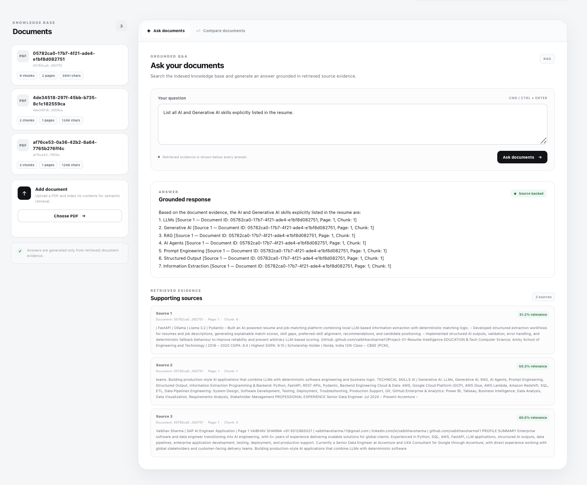
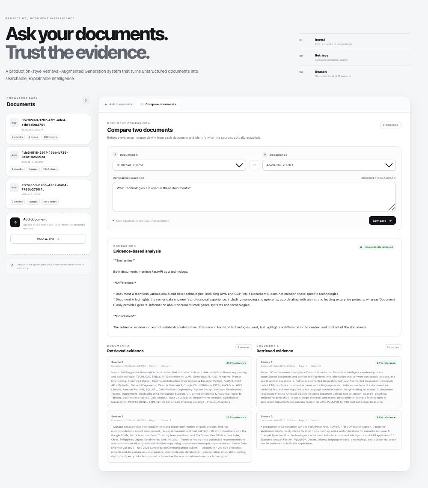

# Project 02 — Document Intelligence & RAG Assistant

A production-style document intelligence application that combines document ingestion, semantic retrieval, Retrieval-Augmented Generation (RAG), grounded question answering, source attribution, and evidence-based document comparison.

The application allows users to upload PDF documents, index their content, retrieve relevant evidence, ask questions against the indexed knowledge base, and compare information across two documents.

---

## Overview

Organizations store large amounts of information in unstructured documents such as resumes, reports, proposals, technical documentation, policies, and business records.

This project demonstrates an end-to-end document intelligence pipeline that transforms uploaded PDF documents into searchable knowledge and uses retrieved document evidence to generate grounded responses.

The system is built around a core principle:

> **The language model should answer from retrieved document evidence rather than relying on unsupported information.**

---

## Key Features

- PDF document upload and ingestion
- PDF text extraction
- Document chunking
- Embedding generation
- Semantic vector retrieval
- Retrieval-Augmented Generation (RAG)
- Grounded question answering
- Source attribution
- Retrieved evidence display
- Document metadata tracking
- Independent document retrieval
- Two-document comparison
- Deterministic extraction for structured categories
- LLM hallucination guardrails
- Local LLM inference using Ollama
- FastAPI REST API
- Dockerized application
- Retrieval evaluation
- Browser-based user interface

---

## Application Screenshots

### Ask Documents

The Ask Documents interface allows users to submit questions against the indexed document collection.

The system retrieves relevant document chunks and generates an answer using the retrieved evidence.



---

### Compare Documents

The Compare Documents interface allows users to select two documents and compare information using independently retrieved evidence from each document.



---

## Architecture

```text
                         ┌──────────────────────┐
                         │       User / UI       │
                         └──────────┬───────────┘
                                    │
                                    ▼
                         ┌──────────────────────┐
                         │      FastAPI API      │
                         └──────────┬───────────┘
                                    │
                  ┌─────────────────┴─────────────────┐
                  │                                   │
                  ▼                                   ▼
        ┌──────────────────┐               ┌──────────────────┐
        │ Document Upload  │               │ Question / Query │
        └────────┬─────────┘               └────────┬─────────┘
                 │                                  │
                 ▼                                  ▼
        ┌──────────────────┐               ┌──────────────────┐
        │ Text Extraction  │               │ Semantic Search  │
        └────────┬─────────┘               └────────┬─────────┘
                 │                                  │
                 ▼                                  ▼
        ┌──────────────────┐               ┌──────────────────┐
        │ Chunking         │               │ Vector Store     │
        └────────┬─────────┘               └────────┬─────────┘
                 │                                  │
                 ▼                                  ▼
        ┌──────────────────┐               ┌──────────────────┐
        │ Embeddings       │──────────────►│ Retrieved Chunks │
        └────────┬─────────┘               └────────┬─────────┘
                 │                                  │
                 ▼                                  ▼
        ┌──────────────────┐               ┌──────────────────┐
        │ Vector Storage   │               │ Ollama / LLM     │
        └──────────────────┘               └────────┬─────────┘
                                                    │
                                                    ▼
                                           ┌──────────────────┐
                                           │ Grounded Answer  │
                                           └──────────────────┘
```

---

## RAG Pipeline

The application separates document ingestion, retrieval, and generation.

### 1. Document Upload

Users upload PDF documents through the web interface.

### 2. Text Extraction

Text is extracted from uploaded PDF documents.

### 3. Chunking

Extracted text is divided into smaller chunks so relevant sections can be retrieved independently.

### 4. Embedding Generation

Document chunks are converted into embeddings for semantic retrieval.

### 5. Vector Storage

Embeddings and document metadata are stored in the vector database.

### 6. Query Retrieval

When a user asks a question, the query is used to retrieve semantically relevant document chunks.

### 7. Evidence Retrieval

The highest-ranked relevant chunks are returned as evidence.

### 8. Grounded Generation

Retrieved evidence is provided to the local language model as context.

The model is instructed to answer using only the supplied document evidence.

### 9. Source Attribution

Retrieved results expose:

- Document ID
- Page number
- Chunk index
- Retrieved text
- Relevance score

This makes the retrieved evidence traceable to the underlying document.

---

## Grounded Question Answering

The question-answering flow is:

```text
User Question
      │
      ▼
Query Processing
      │
      ▼
Semantic Retrieval
      │
      ▼
Relevant Document Chunks
      │
      ▼
Grounded Prompt
      │
      ▼
Local LLM
      │
      ▼
Generated Answer
      │
      ▼
Source Attribution
```

The generation layer is instructed to:

- use only retrieved document evidence
- avoid outside knowledge
- avoid unsupported inference
- preserve terminology used by the document
- avoid inventing missing information
- avoid unsupported acronym expansion
- return a controlled no-answer response when evidence is insufficient

This separates the responsibilities of the retrieval and generation layers instead of treating the language model as the sole source of information.

---

## Document Comparison

The application supports comparison between two independently selected documents.

A key design decision is that each document is retrieved independently rather than combining both documents into one retrieval pool.

```text
                    User Comparison Query
                             │
                ┌────────────┴────────────┐
                │                         │
                ▼                         ▼
           Document A                Document B
                │                         │
                ▼                         ▼
       Independent Retrieval      Independent Retrieval
                │                         │
                ▼                         ▼
          Evidence A                  Evidence B
                │                         │
                └────────────┬────────────┘
                             │
                             ▼
                    Comparison Layer
                             │
                             ▼
                  Similarities / Differences
                             │
                             ▼
                         Conclusion
```

This keeps evidence associated with each document separate.

The comparison implementation also avoids treating document IDs, UUIDs, chunk numbers, or retrieval metadata as substantive differences unless metadata comparison is explicitly requested.

---

## Deterministic Guardrails

Not every task is delegated to the language model.

When the document contains an explicitly labelled category, deterministic Python logic can extract the requested information directly.

For example:

```text
AI / Generative AI:
LLMs, Generative AI, RAG, AI Agents,
Prompt Engineering, Structured Output,
Information Extraction
```

The application can extract the explicitly labelled category without asking the LLM to reconstruct the list.

This helps reduce:

- hallucinated technologies
- accidental category mixing
- unsupported acronym expansion
- omission of explicitly listed items
- unrelated technologies being added to the answer

Technology comparison also uses deterministic extraction when the document structure supports reliable identification of explicitly stated technologies.

---

## Technology Stack

### Backend

- Python
- FastAPI
- Pydantic

### AI / Generative AI

- Ollama
- Llama 3.2
- Embeddings
- Retrieval-Augmented Generation (RAG)

### Document Processing

- PyMuPDF
- Text extraction
- Text chunking
- Document metadata

### Vector Retrieval

- Chroma
- Semantic similarity search
- Embedding-based retrieval

### Frontend

- HTML
- CSS
- JavaScript

### Infrastructure

- Docker
- Docker Compose

### Development

- Git
- GitHub

---

## API

### Health Check

```http
GET /health
```

Returns application health and version information.

---

### List Documents

```http
GET /documents
```

Returns indexed documents and associated metadata.

---

### Upload Document

```http
POST /documents/upload
```

Uploads and indexes a PDF document.

---

### Ask Documents

```http
POST /documents/ask
```

Example request:

```json
{
  "query": "What technologies are used in this document?",
  "top_k": 3,
  "distance_threshold": 450
}
```

The endpoint retrieves relevant evidence and generates a grounded response.

---

### Compare Documents

```http
POST /documents/compare
```

Example request:

```json
{
  "document_a_id": "document-a-id",
  "document_b_id": "document-b-id",
  "query": "What technologies are used in these documents?",
  "top_k": 2
}
```

The endpoint retrieves evidence independently from both documents and generates a grounded comparison.

---

### AI Model Test

```http
POST /ai/test
```

Provides a simple interface for testing communication with the configured Ollama model.

---

## Example Questions

### Document Q&A

```text
What technologies are used in this document?
```

```text
What is the document processing pipeline?
```

```text
What does the document say about retrieval?
```

```text
List the AI and Generative AI skills explicitly
listed in the resume.
```

### Document Comparison

```text
What technologies are used in these documents?
```

```text
What are the similarities between these documents?
```

```text
What technologies are unique to each document?
```

---

## Project Structure

```text
Project-02-Document-Intelligence-RAG/
│
├── app/
│   ├── api/
│   │   └── documents.py
│   │
│   ├── evaluation/
│   │   ├── retrieval_evaluation.py
│   │   └── run_evaluation.py
│   │
│   ├── schemas/
│   │   └── document_schemas.py
│   │
│   ├── services/
│   │   ├── chunking_service.py
│   │   ├── document_catalogue_service.py
│   │   ├── document_service.py
│   │   ├── embedding_service.py
│   │   ├── ingestion_service.py
│   │   ├── ollama_service.py
│   │   ├── rag_service.py
│   │   ├── retrieval_service.py
│   │   └── vector_store.py
│   │
│   └── main.py
│
├── frontend/
│   ├── index.html
│   ├── styles.css
│   └── app.js
│
├── screenshots/
│   ├── askdocument.png
│   └── comparedocument.png
│
├── Dockerfile
├── docker-compose.yml
├── pyproject.toml
└── README.md
```

---

## Running Locally

### Prerequisites

The application requires:

- Docker
- Docker Compose
- Configured Ollama / local model environment

### Start the Application

```bash
docker compose up --build
```

Once the application is running:

```text
http://localhost:8000
```

### Health Check

```bash
curl http://localhost:8000/health
```

Expected response:

```json
{
  "status": "healthy",
  "application": "Document Intelligence & RAG Assistant",
  "version": "1.0.0"
}
```

---

## Evaluation

The project includes a retrieval evaluation module under:

```text
app/evaluation/
```

The evaluation layer is separated from the generation layer.

This distinction is important because a RAG system can produce fluent responses while still retrieving poor or irrelevant evidence.

The project therefore treats retrieval quality as a separate engineering concern.

---

## Engineering Decisions

### Retrieval Before Generation

Relevant document evidence is retrieved before the language model generates an answer.

### Grounded Generation

The LLM receives retrieved document evidence as context and is instructed not to use outside knowledge.

### Deterministic Logic Where Appropriate

Structured extraction and technology comparison can use deterministic Python logic when document structure supports reliable extraction.

### Independent Document Retrieval

Document A and Document B are retrieved independently during comparison.

### Source Traceability

Retrieved evidence includes document and chunk metadata to make answers traceable.

### Local LLM Inference

Ollama provides local model serving for the application.

### Containerized Deployment

Docker and Docker Compose provide a reproducible application environment.

### Separation of Concerns

Document processing, retrieval, generation, vector storage, evaluation, API handling, and frontend behaviour are separated into dedicated components.

---

## Design Principles

The system follows these principles:

1. **Ground answers in retrieved evidence.**
2. **Retrieve before generating.**
3. **Prefer deterministic logic for deterministic tasks.**
4. **Keep document retrieval independent during comparison.**
5. **Expose source metadata for traceability.**
6. **Fail safely when evidence is insufficient.**
7. **Separate retrieval from generation.**
8. **Keep the application reproducible through containerization.**

---

## Limitations

The current implementation is primarily designed as a production-style portfolio project and local demonstration system.

Current limitations include:

- Local model inference
- Local vector storage
- Basic semantic retrieval
- No authentication layer
- No multi-user access control
- No cloud deployment
- No production observability platform
- No background ingestion queue

---

## Future Improvements

Potential improvements include:

- Hybrid keyword + semantic retrieval
- Retrieval reranking
- Streaming LLM responses
- Background document ingestion
- Persistent document management
- Authentication and authorization
- Document-level access controls
- Advanced retrieval evaluation datasets
- Observability and distributed tracing
- Production vector database deployment
- Cloud deployment
- Model evaluation and monitoring

---

## Portfolio Context

This project is part of an Applied AI engineering portfolio focused on building production-style AI systems rather than isolated model demonstrations.

### Project 01 — Resume Intelligence & Job Matching

Focus areas:

- LLM-based information extraction
- Structured AI outputs
- Deterministic matching logic
- Explainable match scoring
- Skill-gap analysis
- Candidate positioning

### Project 02 — Document Intelligence & RAG Assistant

Focus areas:

- Document ingestion
- Text extraction
- Chunking
- Embeddings
- Semantic retrieval
- Retrieval-Augmented Generation
- Grounded question answering
- Source attribution
- Document comparison
- Deterministic extraction
- LLM guardrails

### Project 03 — AI Agent / Tool-Using AI System

Planned focus areas:

- Tool calling
- Agent workflows
- Multi-step execution
- Structured state
- Controlled autonomy
- Tool-based decision making

The portfolio progression is:

```text
LLM Applications
       ↓
RAG & Grounded AI
       ↓
Agentic AI & Tool Use
```

---

## Author

**Vaibhav Sharma**

Senior Data Engineer | Applied AI Engineer

Focused on building production-style AI applications combining:

- Python
- LLM applications
- RAG
- AI agents
- AWS
- Data engineering
- Backend engineering
- Enterprise systems

---

## License

This project is intended as a portfolio and demonstration project.